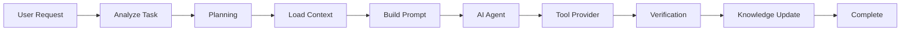
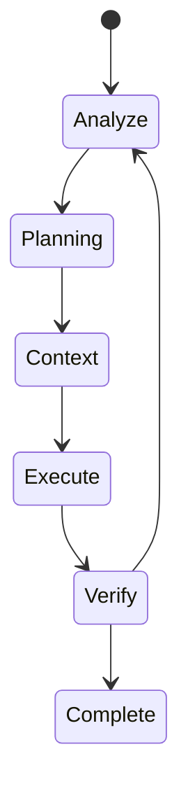

# AI Coding Harness Framework

# 02. Runtime & Architecture Decisions

> [!IMPORTANT]
>
> Tài liệu này mô tả **Runtime Architecture** và **Architecture Decision Records (ADR)**.
>
> Runtime giải thích **Harness hoạt động như thế nào**.
>
> ADR giải thích **tại sao Harness được thiết kế như vậy**.
>
> Đây là cầu nối giữa **Architecture Foundation** và **Overall Architecture**.

---

# Table of Contents

1. Runtime Overview
2. Runtime Lifecycle
3. Runtime Principles
4. Architecture Decision Records
5. Decision Summary
6. Design Constraints
7. Traceability

---

# 1. Runtime Overview

AI Coding Harness không trực tiếp sinh code.

Harness điều phối toàn bộ vòng đời thực thi của một AI Coding Task.

Trong mọi trường hợp, Harness chịu trách nhiệm:

- phân tích yêu cầu
- xác định workflow
- thu thập context
- chuẩn bị prompt
- điều phối tool
- xác minh kết quả
- cập nhật knowledge

AI Agent chỉ chịu trách nhiệm suy luận và đưa ra quyết định.

---

# 2. Runtime Lifecycle



---

## Runtime Responsibilities

| Runtime Stage | Responsibility |
|---------------|---------------|
| Analyze | Hiểu yêu cầu và phân loại task |
| Planning | Lập kế hoạch nếu task đủ phức tạp |
| Context | Thu thập repository context, rules và knowledge |
| Prompt | Chuẩn bị prompt tối ưu cho AI Agent |
| Agent | Suy luận và quyết định hành động |
| Tool Provider | Thực thi các thao tác trên repository hoặc hệ thống ngoài |
| Verification | Kiểm tra kết quả trước khi hoàn thành |
| Knowledge Update | Lưu thông tin có giá trị cho các lần làm việc sau |

---

# 3. Runtime Principles

Runtime phải tuân thủ các nguyên tắc sau:

- Deterministic
- Observable
- Inspectable
- Recoverable
- Human-in-the-loop
- Verification-first

Planning chỉ bắt buộc khi cần.

Verification luôn bắt buộc.

Knowledge chỉ cập nhật sau khi verification thành công.

---

# 4. Architecture Decision Records

## ADR-001 — Lightweight Overlay Architecture

### Decision

Harness hoạt động như một lớp phủ (Overlay) trên repository hiện có.

### Motivation

- Không thay đổi workflow hiện tại.
- Không phụ thuộc IDE.
- Không phụ thuộc AI Agent.

### Consequences

Ưu điểm

- Đơn giản.
- Dễ triển khai.
- Dễ bảo trì.

Nhược điểm

- Không kiểm soát toàn bộ môi trường thực thi.

---

## ADR-002 — Repository Knowledge Provider

### Decision

Harness phải có khả năng cung cấp context ở mức repository.

### MVP Implementation

- Tree-sitter Repository Map

### Future Options

- SCIP
- LSP
- Semantic Index

### Motivation

Giảm context overload và tăng chất lượng context.

---

## ADR-003 — Persistent Knowledge

### Decision

Harness phải duy trì kiến thức giữa nhiều session.

### MVP Implementation

Markdown Knowledge Store.

### Future Options

- SQLite
- Remote Store
- Vector Store (nếu có bằng chứng cần thiết)

### Motivation

Đơn giản, minh bạch và dễ quản lý bằng Git.

---

## ADR-004 — Runtime Orchestration

### Decision

Harness chịu trách nhiệm điều phối Runtime.

Workflow chỉ là một capability của Runtime.

### Motivation

Tách biệt orchestration khỏi AI reasoning.

### Consequences

Agent có thể thay thế mà không ảnh hưởng Runtime.

---

## ADR-005 — Verification-first

### Decision

Không task nào được coi là hoàn thành nếu chưa verification.

### Verification Examples

- Build
- Test
- Lint
- Static Analysis
- Security Check

### Motivation

Giảm hallucination và tăng độ tin cậy.

---

## ADR-006 — Tool Provider Abstraction

### Decision

Harness không phụ thuộc một giao thức tool duy nhất.

### Supported Providers

- Native CLI
- MCP
- REST
- SDK

### Motivation

Giảm vendor lock-in.

---

## ADR-007 — Context Lifecycle

### Decision

Context phải có vòng đời rõ ràng.

```text
Load

↓

Rank

↓

Filter

↓

Compress

↓

Inject

↓

Discard
```

### Motivation

Giảm token usage.

Tăng context quality.

---

## ADR-008 — Runtime State Machine

### Decision

Runtime phải có trạng thái rõ ràng.



### Motivation

Runtime dễ quan sát và dễ phục hồi khi lỗi.

---

## ADR-009 — Knowledge Priority

### Decision

Nguồn thông tin phải có thứ tự ưu tiên.

```text
User Instructions

↓

Repository

↓

Harness Knowledge

↓

External Knowledge

↓

Model Knowledge
```

### Motivation

Giảm hallucination.

Đảm bảo repository luôn là nguồn sự thật chính.

---

# 5. Decision Summary

| ADR | Decision | MVP Implementation |
|------|----------|--------------------|
| ADR-001 | Overlay Architecture | Local CLI |
| ADR-002 | Repository Knowledge Provider | Tree-sitter |
| ADR-003 | Persistent Knowledge | Markdown |
| ADR-004 | Runtime Orchestration | Rule-based Runtime |
| ADR-005 | Verification-first | Build/Test/Lint |
| ADR-006 | Tool Provider Abstraction | Native + MCP |
| ADR-007 | Context Lifecycle | Rule-based Ranking |
| ADR-008 | Runtime State Machine | Deterministic Runtime |
| ADR-009 | Knowledge Priority | Repository-first |

---

# 6. Design Constraints

Mọi implementation phải tuân thủ:

- Architecture Foundation
- Architecture Drivers
- Design Principles
- Runtime Principles

Implementation có thể thay đổi.

Architecture Decisions chỉ thay đổi thông qua ADR.

---

# 7. Traceability

```mermaid
flowchart TD

Foundation

--> Runtime

Runtime

--> ADR

ADR

--> Overall Architecture

Overall Architecture

--> Module Specifications

Module Specifications

--> Implementation
```

Mọi module trong hệ thống phải truy ngược được ít nhất một ADR.

---

# Final Statement

> [!IMPORTANT]
>
> Runtime mô tả **Harness hoạt động như thế nào**.
>
> ADR mô tả **vì sao Harness được thiết kế như vậy**.
>
> Overall Architecture sẽ mô tả **Harness được tổ chức thành những module nào**.
>
> Ba tài liệu này tạo thành nền tảng kiến trúc của AI Coding Harness Framework.