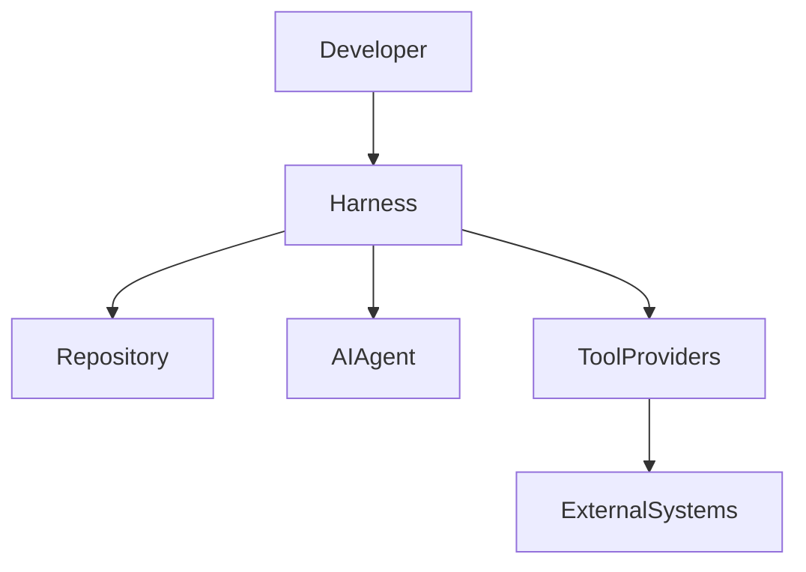
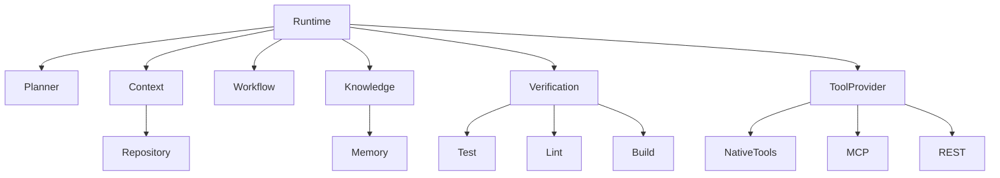
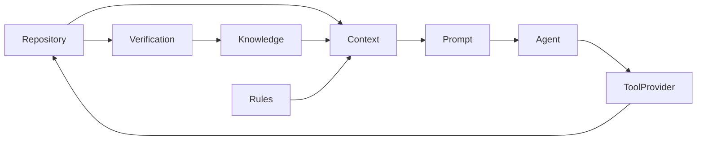

# AI Coding Harness Framework

# 03. Overall Architecture

> [!IMPORTANT]
>
> Tài liệu này mô tả **kiến trúc tổng thể** của AI Coding Harness Framework.
>
> Runtime được mô tả trong **02_RUNTIME_MODEL_AND_ARCHITECTURE_DECISIONS.md**.
>
> Tài liệu này chỉ mô tả:
>
> - các capability
> - các module
> - dependency
> - data flow
> - repository structure
> - extension points

---

# Table of Contents

1. Architecture Overview
2. Design Goals
3. Architecture Layers
4. Core Capabilities
5. Module Architecture
6. Dependency Rules
7. Data Flow
8. Extension Points
9. Repository Structure
10. Cross-Cutting Concerns
11. Design Principles
12. Traceability

---

# 1. Architecture Overview

AI Coding Harness được thiết kế theo mô hình **Layered + Capability-based Architecture**.

Harness đóng vai trò điều phối giữa:

- Developer
- AI Agent
- Repository
- External Tools

Harness không phụ thuộc:

- IDE
- AI Model
- Vendor

---



---

# 2. Design Goals

Kiến trúc phải đạt được:

- Low Coupling
- High Cohesion
- Replaceable Components
- Clear Responsibilities
- Vendor Independence
- Extensibility
- Simplicity

---

# 3. Architecture Layers

```text
Presentation Layer

↓

Application Layer

↓

Domain Layer

↓

Infrastructure Layer
```

---

## Presentation Layer

Chịu trách nhiệm:

- CLI
- IDE Adapter
- Future UI

---

## Application Layer

Điều phối các capability.

Không chứa business rule.

---

## Domain Layer

Chứa toàn bộ logic của Harness.

Đây là trung tâm của hệ thống.

---

## Infrastructure Layer

Cung cấp implementation.

Ví dụ

- File System
- Git
- MCP
- Terminal
- Network

---

# 4. Core Capabilities

Harness được xây dựng từ các capability sau.

| Capability | Responsibility |
|------------|----------------|
| Planning | Lập kế hoạch khi cần |
| Context | Thu thập và chuẩn bị context |
| Knowledge | Lưu trữ và tái sử dụng kiến thức |
| Workflow | Điều phối các bước thực hiện |
| Verification | Kiểm tra kết quả |
| Tool Execution | Gọi công cụ bên ngoài |
| Convention | Quản lý quy tắc |
| Repository | Hiểu cấu trúc source code |

Mỗi capability có thể có nhiều implementation.

---

# 5. Module Architecture



---

## Module Responsibilities

### Runtime

Điều phối toàn bộ Harness.

Không chứa implementation.

---

### Planner

Quản lý planning.

Không trực tiếp chỉnh sửa code.

---

### Context

Thu thập context.

Xếp hạng context.

Nén context.

---

### Repository

Phân tích source code.

Không quan tâm AI.

---

### Knowledge

Quản lý knowledge.

Không chịu trách nhiệm retrieval.

---

### Workflow

Định nghĩa workflow.

Không thực thi workflow.

---

### Tool Provider

Abstraction của mọi tool.

---

### Verification

Đánh giá kết quả.

Không sửa code.

---

# 6. Dependency Rules

```text
Presentation

↓

Application

↓

Domain

↓

Infrastructure
```

---

Rules

- Domain không phụ thuộc Infrastructure.
- Capability không gọi trực tiếp capability khác.
- Mọi giao tiếp đi qua Runtime.
- Infrastructure có thể thay thế.

---

# 7. Data Flow



---

# 8. Extension Points

Các điểm mở rộng.

## Agent Adapter

Ví dụ

- Claude Code
- Codex
- Gemini
- Cursor

---

## Tool Provider

Ví dụ

- MCP

- Native

- REST

---

## Knowledge Provider

Ví dụ

- Markdown

- SQLite

- Remote Store

---

## Repository Provider

Ví dụ

- Tree-sitter

- SCIP

- LSP

---

## Workflow

Có thể bổ sung workflow mới.

Không sửa Runtime.

---

# 9. Repository Structure

```text
.harness

├── runtime

├── planner

├── workflow

├── context

├── repository

├── knowledge

├── verification

├── tools

├── adapters

├── rules

├── memory

├── cache

├── logs

└── config
```

Mỗi thư mục tương ứng một capability.

---

# 10. Cross-Cutting Concerns

Các concern áp dụng cho toàn hệ thống.

- Logging
- Configuration
- Error Handling
- Metrics
- Security
- Audit
- Caching

Không module nào được tự triển khai concern riêng.

---

# 11. Design Principles

Mỗi module phải:

- Single Responsibility
- Replaceable
- Observable
- Testable
- Stateless nếu có thể

Không module nào được:

- biết implementation của module khác
- phụ thuộc IDE
- phụ thuộc AI Vendor

---

# 12. Traceability

```mermaid
flowchart LR

Foundation

-->

ADR

-->

Overall Architecture

-->

Module Specifications

-->

Implementation
```

Mọi module trong kiến trúc đều phải:

- giải quyết một Architecture Driver
- tuân thủ ít nhất một ADR
- có trách nhiệm rõ ràng
- có thể thay thế implementation

---

# Final Statement

> [!IMPORTANT]
>
> Overall Architecture xác định **Harness được chia thành những capability và module nào**.
>
> Runtime mô tả **Harness vận hành ra sao**.
>
> Module Specifications sẽ mô tả **chi tiết từng module**.
>
> Ba tài liệu này tạo thành kiến trúc hoàn chỉnh của AI Coding Harness Framework.