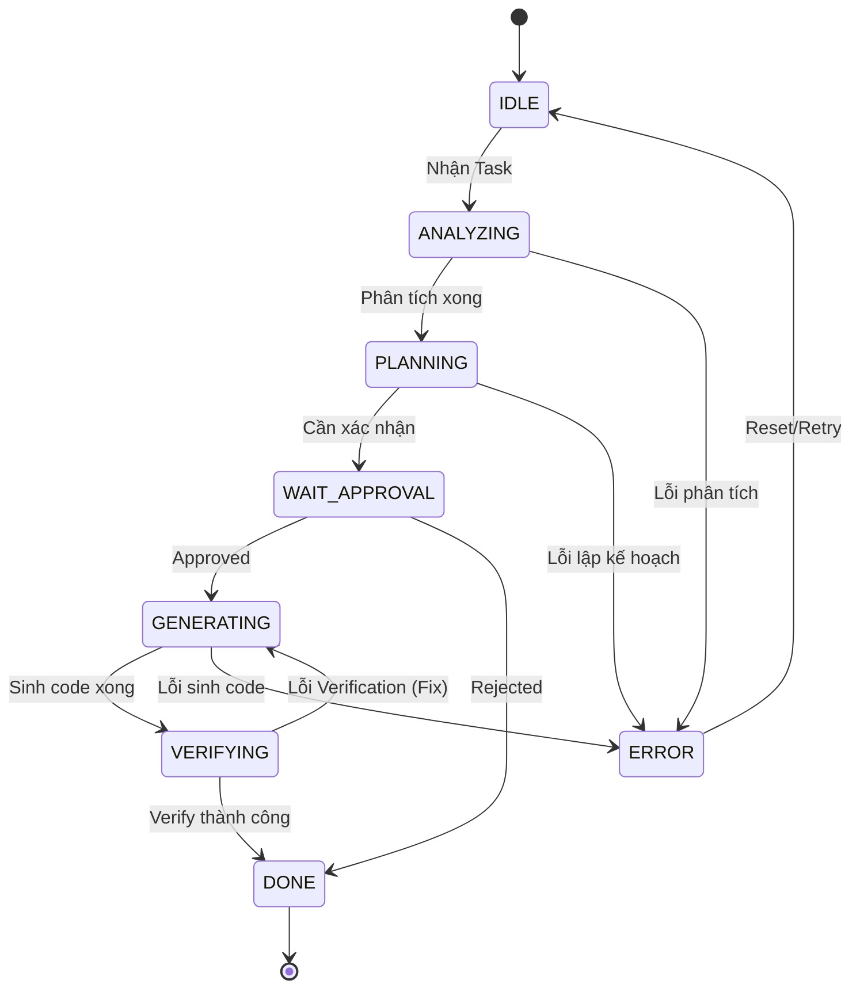

# Task State Machine

Mọi tác vụ (Task) trong Harness đều tuân theo một state machine nghiêm ngặt để đảm bảo khả năng tracing và recovery.

## 1. State Diagram

## 2. State Descriptions

* **IDLE:** Chờ lệnh từ user.
* **ANALYZING:** Thu thập context từ Repository (sử dụng Context Engine).
* **PLANNING:** Lập kế hoạch các bước thực thi (Planning Engine).
* **WAIT_APPROVAL:** (Tùy chọn) Chờ user xác nhận kế hoạch trước khi chạy.
* **GENERATING:** AI đang thực hiện viết code/sửa code.
* **VERIFYING:** Chạy test, linter, build để xác minh kết quả.
* **DONE:** Hoàn thành toàn bộ task.
* **ERROR:** Trạng thái lỗi không thể phục hồi tự động, cần user can thiệp.
