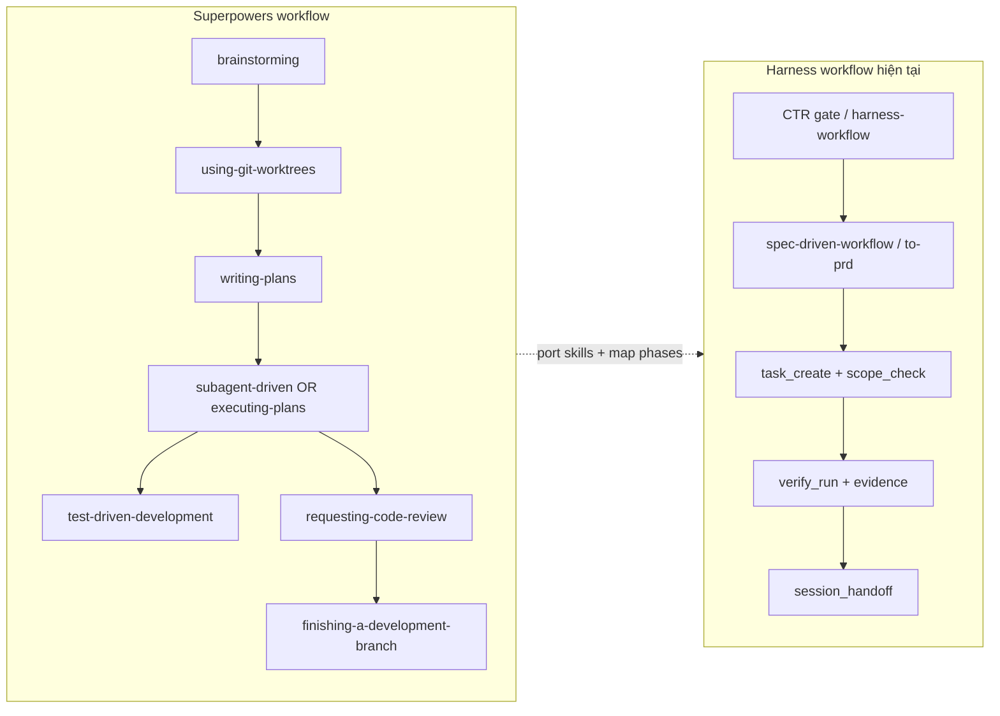

# Plan: Tích hợp Superpowers vào harness-os

**Ngày**: 2026-05-29  
**Phiên bản**: 1.0  
**Trạng thái**: Draft  
**Ưu tiên**: High  
**Nguồn tham chiếu**: [obra/superpowers](https://github.com/obra/superpowers) (MIT, v5.1.0)

> **For agentic workers:** Khi implement plan này, dùng skill `subagent-driven-development` (sau khi port) hoặc `executing-plans` task-by-task. Steps dùng checkbox (`- [ ]`) để tracking.

---

## Tóm tắt

Nghiên cứu [Superpowers](https://github.com/obra/superpowers) — framework methodology + 14 skills cho coding agents — và **port/adapt** vào harness-os thay vì cài song song Cursor plugin.

**Mục tiêu:** Một nguồn sự thật qua MCP harness (`skill_load`, `skill_suggest`, `verify_run`, `session_handoff`), giữ enforcement harness (scope, verify, audit) và bổ sung workflow Superpowers (brainstorm → worktree → plan → subagent execute → TDD → review → finish branch).

**Không làm:** Port `.cursor-plugin/`, `hooks/`, `agents/`, `commands/`; không cài `/add-plugin superpowers` song song.

---

## Bối cảnh: hai hệ thống khác nhau nhưng bổ sung

| Khía cạnh | Superpowers | harness-os (v1.3.0) |
|-----------|-------------|---------------------|
| **Vai trò** | Methodology + skills library (IDE plugin) | MCP server + session/task/verify/scope + skills |
| **Kích hoạt skill** | Plugin/hooks IDE (`sessionStart`) | `skill_suggest` (tier 1 + keyword), `session_start` (tier 1 only) |
| **Frontmatter** | Chỉ `name` + `description` | agentskills.io + `metadata` (tier, keywords, applies_to, version) |
| **Enforcement** | Mandatory workflows qua instructions | `verify_run`, `scope_check`, SQLite audit, handoff |
| **Số skills** | 14 trong `skills/` | 26 built-in trong `skills/` |



**Kết luận:** Superpowers **không thay** harness MCP. Giá trị khi vendor: **nội dung methodology** (skills dài, prompt con, checklist) và **chuỗi workflow** rõ. Plugin/hooks Superpowers không port — xem `ide-adapters/` và `HARNESS-OS-PLAN.md` Phase 6+ hooks.

---

## 14 skills Superpowers — map với harness

### A. Port mới (chưa có hoặc thiếu đáng kể)

| Superpowers skill | Hành động | Tier / keywords gợi ý |
|-------------------|-----------|------------------------|
| `brainstorming` | Thêm mới — bổ sung `design-grilling`, `to-prd` | tier 2: `design`, `spec`, `requirements`, `thiết kế` |
| `using-git-worktrees` | Thêm mới | tier 2: `branch`, `worktree`, `isolated`, `nhánh` |
| `writing-plans` | Thêm mới — chuẩn plan header (đã dùng trong `2026-05-27-harness-v0.7-improvements.md`) | tier 2: `plan`, `implementation`, `kế hoạch` |
| `subagent-driven-development` | Thêm mới + `references/` (implementer, spec-reviewer, code-quality prompts) | tier 2: `execute`, `subagent`, `plan` |
| `executing-plans` | Thêm mới (batch + checkpoint) | tier 2: `batch`, `checkpoint`, `plan` |
| `finishing-a-development-branch` | Thêm mới | tier 2: `merge`, `pr`, `done`, `hoàn thành` |
| `requesting-code-review` | Thêm mới | tier 2: `review`, `code-review` |
| `receiving-code-review` | Thêm mới | tier 2: `feedback`, `review` |
| `using-superpowers` | Adapt → `using-harness-skills` | tier 3 (on-demand) |

### B. Merge / nâng cấp skill hiện có

| Superpowers | Harness hiện tại | Chiến lược |
|-------------|------------------|------------|
| `test-driven-development` | `tdd-workflow` | Merge: Iron Law, rationalizations, checklist; giữ vertical-slice philosophy harness |
| `systematic-debugging` | `systematic-diagnosis` | Bổ sung: root-cause-tracing, defense-in-depth, condition-based-waiting |
| `verification-before-completion` | `verification-loop` | Align với `verify_run` + evidence |
| `dispatching-parallel-agents` | `parallel-coordination` | Bổ sung fresh-context-per-task, subagent dispatch patterns |

### C. Giữ nguyên harness

- Lifecycle MCP: `session.ts`, `task.ts`, `verify.ts`, `scope.ts`
- Orchestrator: `harness-workflow` — **cập nhật** phase map, không thay thế
- Stack C#: 6 skills `csharp-*`
- Instincts: `instinct_*`

---

## Khác biệt format — bắt buộc khi port

Superpowers:

```yaml
---
name: test-driven-development
description: Use when implementing any feature or bugfix...
---
```

Harness (`docs/12-skill-format.md`):

```yaml
---
name: test-driven-development
description: "..."
metadata:
  version: "1.0"
  updated: "2026-05-29"
  applies_to: ["*"]
  tier: 2
  keywords: ["tdd", "test", "kiểm thử"]
---
```

**Checklist port mỗi skill:**

- [ ] Giữ body + `references/`; đổi `@file.md` → path tương đối trong skill folder
- [ ] Thêm `metadata` harness
- [ ] Thay `superpowers:*` → tên skill harness (`skill_load`)
- [ ] Thay `docs/superpowers/plans/` → `~/.harness/repos/{repo_id}/artifacts/plans/`
- [ ] Attribution MIT (`references/LICENSE-superpowers.md` hoặc footer)
- [ ] `harness doctor --check-skills-frontmatter`

**Script:** `scripts/import-superpowers-skills.ts` — shallow clone tag `v5.1.0`, transform frontmatter; không commit raw superpowers tree.

---

## Phase map trong `harness-workflow`

| Phase | Skills | MCP tools |
|-------|--------|-----------|
| Design | `brainstorming`, `design-grilling`, `to-prd` | `progress_log`, artifacts/plans |
| Isolate workspace | `using-git-worktrees` | git CLI (ngoài MCP) |
| Plan | `writing-plans`, `spec-driven-workflow` | artifact plans |
| Execute | `subagent-driven-development` hoặc `executing-plans` | `task_create`, `task_update`, `scope_check` |
| Implement | `tdd-workflow` | `verify_run` |
| Review | `requesting-code-review`, `architecture-review` | `progress_log` |
| Complete | `finishing-a-development-branch`, `verification-loop` | `verify_run`, `session_handoff` |

`session_start` vẫn chỉ tier-1: `karpathy-guidelines`, `harness-workflow`, `strategic-compact` — tránh trigger overload (xem `2026-05-29-skills-refactor.md`).

---

## Phase triển khai

### Phase 1 — Foundation (1–2 ngày)

- [ ] Tạo `scripts/import-superpowers-skills.ts`
- [ ] Port `brainstorming`, `writing-plans`, `using-git-worktrees`
- [ ] Cập nhật `skills/harness-workflow/SKILL.md` — section phase map
- [ ] Cập nhật `AGENTS.md`, `README.md` (skill count, workflow)
- [ ] Tests frontmatter cho skills mới

### Phase 2 — Execution & quality (2–3 ngày)

- [ ] Port `subagent-driven-development`, `executing-plans` + reference prompts
- [ ] Merge `test-driven-development` → `tdd-workflow`
- [ ] Merge `systematic-debugging` → `systematic-diagnosis`
- [ ] Align `verification-before-completion` → `verification-loop`

### Phase 3 — Collaboration & finish (1–2 ngày)

- [ ] Port `requesting-code-review`, `receiving-code-review`, `finishing-a-development-branch`
- [ ] Enhance `parallel-coordination` từ `dispatching-parallel-agents`
- [ ] Thêm `using-harness-skills`

### Phase 4 — Tooling & docs (tùy chọn)

- [ ] Keyword bundles theo phase cho `skill_suggest` (không revive `triggers` runtime)
- [ ] Plan template trong `templates/` (header từ `writing-plans`)
- [ ] Smoke test / doctor nếu skill count đổi
- [ ] **Không** build `subagent_invoke` MCP — dùng Task/subagent IDE (HARNESS-OS-PLAN Phase 6+)

---

## Không tích hợp / rủi ro

| Thành phần | Lý do |
|------------|--------|
| `.cursor-plugin/`, `hooks/` | Harness = MCP; hooks IDE-side riêng |
| `agents/`, `commands/` | Cursor/Codex-specific |
| Plugin song song | Trùng instruction, conflict workflow |
| Copy skills không metadata | `skill_suggest` / doctor fail |
| Đổi tên MCP tools | Vi phạm public API (`AGENTS.md` §11) |

**License:** Superpowers MIT — giữ copyright khi adapt.

---

## Kết quả mong đợi

- ~**+9 skills mới**, **~5 skills enrich** → ~35 built-in
- Workflow `harness-workflow` tương thích mental model Superpowers, chạy qua MCP harness
- Agent dùng `skill_load` / `skill_suggest`, không namespace `superpowers:`
- Không phụ thuộc Cursor plugin marketplace

---

## Verify sau mỗi phase

```bash
bun run build
bun test
bun run smoke
bun run dev -- doctor --check-skills-frontmatter
bun run dev -- skills --list
```

---

## File structure (dự kiến)

```
New/updated:
├── scripts/import-superpowers-skills.ts
├── skills/brainstorming/SKILL.md
├── skills/writing-plans/SKILL.md
├── skills/using-git-worktrees/SKILL.md
├── skills/subagent-driven-development/SKILL.md
├── skills/subagent-driven-development/references/*.md
├── skills/executing-plans/SKILL.md
├── skills/finishing-a-development-branch/SKILL.md
├── skills/requesting-code-review/SKILL.md
├── skills/receiving-code-review/SKILL.md
├── skills/using-harness-skills/SKILL.md
├── skills/harness-workflow/SKILL.md          (modify)
├── skills/tdd-workflow/SKILL.md              (modify)
├── skills/systematic-diagnosis/SKILL.md      (modify)
├── skills/verification-loop/SKILL.md         (modify)
├── skills/parallel-coordination/SKILL.md     (modify)
├── AGENTS.md                                 (modify)
└── README.md                                 (modify)
```
