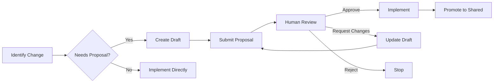

# Governance Checkpoint

## Overview

Before making any change, verify whether it needs governance approval. Changes to public contracts, data models, domain boundaries, or CLI/MCP interfaces require a proposal. Internal refactors and bug fixes generally do not.

**Core principle:** Check governance BEFORE implementing. A rejected proposal costs minutes. Rejected code costs hours.

## When to Use

**ALWAYS check before:**
- Changing public API/contracts (service interfaces, tool schemas)
- Adding or removing capabilities
- Modifying data models or types
- Changing CLI commands or flags
- Changing MCP tool definitions
- Modifying manifest schemas
- Adding npm dependencies
- Breaking backward compatibility
- Changing domain structure or boundaries

**SKIP check for:**
- Internal refactors (no public contract change)
- Bug fixes
- Adding tests
- Documentation updates
- Fixing typos
- Code style improvements

## Governance Workflow



## Proposal Lifecycle

| Status | Description | Action Required |
|--------|-------------|-----------------|
| DRAFT | Being written | Create content |
| SUBMITTED | Waiting for review | Wait for human approval |
| REVIEWING | Under active review | None (30-min lock) |
| APPROVED | Ready to implement | Implement then promote |
| REJECTED | Denied | Stop. Do not implement |
| PROMOTED | Changes applied | Done |

## CLI Commands

```bash
# List proposals by status
harness proposal list --status DRAFT

# Create a new proposal from a markdown file
harness proposal submit --file path/to/proposal.md

# Submit an existing draft proposal by ID
harness proposal submit <proposal-id>

# Approve a proposal (HUMAN ONLY)
harness proposal approve <proposal-id>

# Reject a proposal
harness proposal reject <proposal-id> --comments "reason"

# Request changes to a proposal
harness proposal request-changes <proposal-id> --comments "needs more evidence"

# Promote an approved proposal to shared
harness proposal promote <proposal-id>
```

## Decision Guide

Does your change affect any of these?

- [ ] **Public interfaces** — service contracts, capability definitions, tool schemas
- [ ] **Data models** — types, DTOs, enums in `shared/types/` or `knowledge_base/11_DATA_MODELS.md`
- [ ] **CLI commands** — new commands, changed flags, removed subcommands
- [ ] **MCP tools** — new/removed/changed tool definitions
- [ ] **Domain structure** — new domain, merged domains, changed dependency direction
- [ ] **capabilities** — added/removed/changed capability IDs or schemas
- [ ] **Dependencies** — new npm packages
- [ ] **Manifest schema** — changed `harness.yaml` structure

If ANY box is checked → submit a proposal before implementing.

## Common Mistakes

- **Implementing first, asking later:** "I'll just fix this quickly" — if it needs a proposal, you've wasted time
- **Skipping for "trivial" changes:** "It's just one field" — one field in a public contract affects all consumers
- **Confusing internal refactor with API change:** Moving code internally is fine; changing how it's called is not
- **Forgetting to promote:** Approved but not promoted means changes aren't shared

## Remember

- Governance exists to prevent breaking changes, not to slow you down.
- Bug fixes, tests, docs, and typos NEVER need a proposal.
- When in doubt, submit a DRAFT proposal and ask.
- `harness proposal list --status DRAFT` to see your drafts.
- Proposals are lightweight markdown files — prefer quick drafts over guessing.
